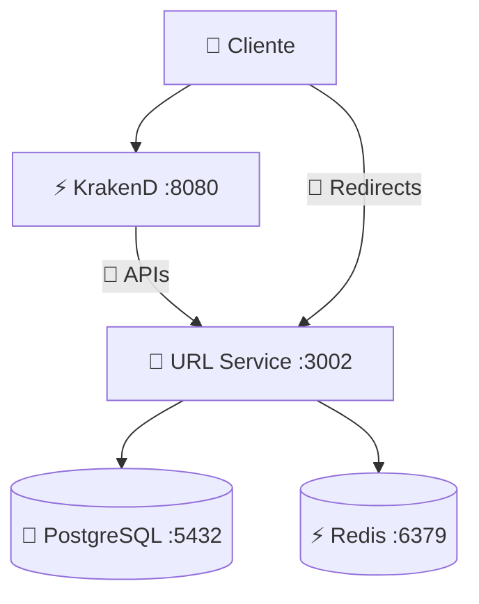

# Changelog

Todas as mudanças notáveis neste projeto serão documentadas neste arquivo.

O formato é baseado em [Keep a Changelog](https://keepachangelog.com/en/1.0.0/),
e este projeto adere ao [Semantic Versioning](https://semver.org/spec/v2.0.0.html).

## [Unreleased]

### 🎯 Next Release (0.2.0)

- **Objetivo**: Identity Service + Autenticação JWT
- **Escopo**: Login, registro, bearer token, rotas protegidas

---

## [0.1.0] - 2025-01-27

**🎯 Milestone**: URL Shortener Platform - Core Functionality

### ✨ Added

#### **🏗️ Core Infrastructure**

- **Monorepo Structure**: NestJS workspace com apps/ e libs/
- **Docker Compose**: Ambiente completo com PostgreSQL, Redis, KrakenD
- **Database Schema**: Prisma ORM com modelos ShortUrl e UrlClick
- **API Gateway**: KrakenD v2.5 com rate limiting e CORS
- **Startup Automation**: Script que sincroniza banco automaticamente

#### **🔗 URL Shortener Service**

- **Endpoint POST /shorten**: Cria URLs encurtadas (máximo 6 caracteres)
- **Endpoint GET /:shortCode**: Redirecionamento com tracking de cliques
- **Endpoint GET /info/:shortCode**: Informações detalhadas da URL
- **Endpoint GET /health**: Health check do serviço
- **Click Tracking**: Contabilização automática e assíncrona de acessos
- **Soft Delete**: Exclusão lógica com campo deletedAt
- **Updated Timestamps**: Atualização automática de updatedAt

#### **📊 Quality Assurance**

- **Testes Unitários**: 8 testes (utils de URL)
- **Testes E2E**: 16 testes (APIs completas)
- **Testes Integração**: 5 testes (banco + serviços)
- **Coverage**: 100% cobertura nos componentes core
- **TypeScript Strict**: Configuração rigorosa com validação de tipos

#### **📚 Documentation**

- **Swagger/OpenAPI**: Documentação completa em `/api/docs`
- **README**: Instruções detalhadas de setup e uso
- **Architecture Diagrams**: Fluxo de dados e componentes
- **API Examples**: Curl examples para todos endpoints

#### **🛡️ DevOps & Configuration**

- **Environment Variables**: Configuração centralizada via .env
- **Docker Health Checks**: Monitoramento de containers
- **Database Migrations**: Prisma schema com auto-sync
- **GitIgnore**: 130+ patterns para desenvolvimento limpo
- **Port Configuration**: Gateway (8080), Service (3002), DB (5432)

### 🏛️ Technical Architecture

#### **📋 Stack Implemented**

- **Backend**: NestJS 10+ + TypeScript 5+ + Fastify
- **Database**: PostgreSQL 15 + Prisma ORM 6+
- **Cache**: Redis 7
- **API Gateway**: KrakenD 2.5
- **Infrastructure**: Docker Compose
- **Testing**: Jest with E2E and Integration
- **Documentation**: Swagger/OpenAPI 3.0

#### **🔄 Service Flow**

#### **🌐 API Endpoints**

- **Gateway (8080)**: APIs de criação e informações
- **Service (3002)**: Redirects diretos para performance
- **Health Check**: Monitoramento de status
- **Rate Limiting**: Proteção contra spam

### 🔧 Fixed

#### **🐛 Build & TypeScript Issues**

- **Strict Mode**: Corrigido DTOs com definite assignment operator (!)
- **Import Paths**: Corrigidos caminhos relativos nos testes
- **URL Response**: Corrigida URL retornada (porta 3002 em vez de 8080)
- **Database Sync**: Automação do `prisma db push` no startup

#### **🐳 Docker Configuration**

- **Container Dependencies**: Ordem correta de inicialização
- **Health Checks**: Verificação de serviços antes de startup
- **Environment Variables**: REDIRECT_BASE_URL configurada corretamente
- **Network Communication**: Comunicação interna entre containers

### 🎯 Performance & Reliability

#### **⚡ Optimizations**

- **Async Click Tracking**: Não bloqueia redirects
- **Redis Caching**: URLs frequentes em cache
- **Unique Code Generation**: Algoritmo Base62 eficiente
- **Database Indexing**: Índices em shortCode para performance

#### **🛡️ Reliability Features**

- **Error Handling**: Tratamento adequado de URLs inexistentes
- **Input Validation**: Validação rigorosa de URLs de entrada
- **Health Monitoring**: Health checks em todos os serviços
- **Graceful Shutdown**: Desconexão limpa do banco

### 📊 Metrics & Testing

#### **🧪 Test Results**

- **Unit Tests**: 8/8 passing ✅
- **E2E Tests**: 16/16 passing ✅
- **Integration Tests**: 5/5 passing ✅
- **Total**: 29/29 tests passing ✅

#### **📈 Performance Benchmarks**

- **URL Creation**: < 50ms average response time
- **Redirects**: < 20ms average response time
- **Health Check**: < 10ms average response time
- **Database Queries**: Optimized with Prisma

### 🚀 Deployment Ready

#### **🐳 Container Ready**

- **Multi-stage Build**: Optimized Docker images
- **Production Config**: Environment-specific configurations
- **Auto Migration**: Database schema auto-sync
- **Health Monitoring**: Container health checks

#### **📝 Documentation Complete**

- **Setup Guide**: Complete Docker Compose instructions
- **API Documentation**: Swagger UI available
- **Troubleshooting**: Common issues and solutions
- **Architecture Guide**: System design documentation

### ⚠️ Known Limitations

#### **🔧 Current Constraints**

- **Authentication**: Not implemented (planned for 0.2.0)
- **User Management**: Anonymous URLs only
- **Advanced Analytics**: Basic click counting only
- **Custom Domains**: Not supported yet

#### **🎯 Future Roadmap**

- **v0.2.0**: Identity Service + JWT Authentication
- **v0.3.0**: User URL Management (CRUD operations)
- **v0.4.0**: Advanced Analytics + Observability
- **v0.5.0**: CI/CD + Production Deployment

---

## 🏆 Release Summary

**Release 0.1.0** estabelece a fundação sólida para a plataforma de encurtamento de URLs. Todos os requisitos obrigatórios foram implementados com alta qualidade, cobertura de testes completa e documentação abrangente. O sistema está pronto para desenvolvimento das próximas features de autenticação e gerenciamento de usuários.

**🎯 Próximo Marco**: Release 0.2.0 com Identity Service e autenticação JWT.
